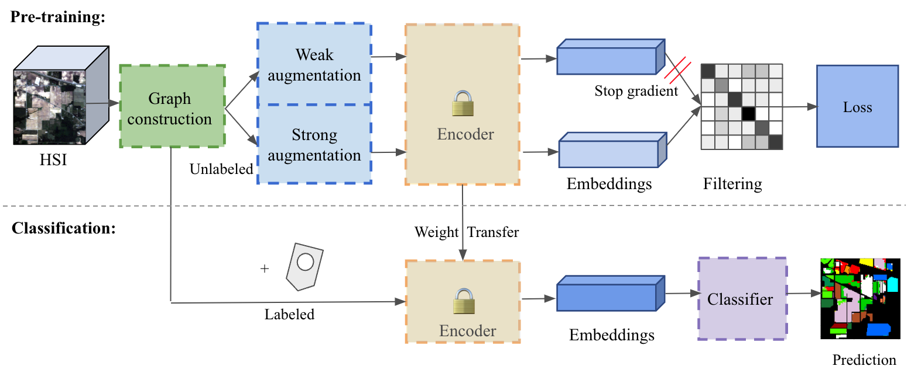

# WSGraphCL: Weak-Strong Graph Contrastive Learning for Hyperspectral Image Classification

[](LICENSE)
[](https://www.python.org/downloads/)

This repository contains the implementation of **WSGraphCL**, a weak-strong graph contrastive learning model designed for hyperspectral image (HSI) classification. The model is built to effectively handle noisy HSI data and requires only a limited amount of labeled data, making it particularly suitable for few-shot learning scenarios. For more details, please refer to our [paper](https://github.com/zhu-xlab/WSGraphCL).

## Table of Contents
- [Introduction](#introduction)
- [Key Features](#key-features)
- [Installation](#installation)
- [Usage](#usage)
- [Experiments](#experiments)
- [Citation](#citation)
- [License](#license)

## Introduction

Hyperspectral images contain rich spectral and spatial information, making them valuable for various remote sensing applications. However, accurately classifying fine-grained land cover types in noisy HSIs remains challenging. Existing deep learning models often struggle with feature extraction from noisy data and require large labeled datasets for training.

To tackle these challenges, we propose **WSGraphCL**, a novel model that integrates contrastive learning and graph neural networks (GNNs). By leveraging weak-strong augmentations and filtering false negative pairs, our method stabilizes the pre-training process and learns robust representations. This enables effective HSI classification with minimal labeled data.

  <!-- Update this path with the actual path to your image -->

## Key Features

- **Graph Neural Network Architecture**: Utilizes a spectral-spatial adjacency matrix to construct K-hop subgraphs for effective feature extraction.
- **Contrastive Learning**: Pre-trains a graph-based encoder on unlabeled HSI data, reducing the need for extensive manual annotations.
- **Weak-Strong Augmentations**: Enhances the quality of learned representations by leveraging diverse augmentations during training.
- **Few-Shot Learning**: Demonstrates superior performance even with a handful of labeled samples, addressing the challenge of data scarcity.

## Installation

Clone the repository and install the required packages:

```bash
git clone https://github.com/zhu-xlab/WSGraphCL.git
cd WSGraphCL
pip install -r requirements.txt
```

## Usage

### Preprocessing

Prepare the Dataset: Download and prepare your hyperspectral dataset. Ensure it is in the correct format as expected by the data loader.

### Training

To train the WSGraphCL model, use the following .ipynb files:
```bash
1. model/Indian_pines_mainfile.ipynb
2. model/Pavia_uni_mainfile.ipynb
3. model/MDAS_mainfile.ipynb
```
## Experiments

We conducted extensive experiments to validate the effectiveness of WSGraphCL under various few-shot scenarios. Our model consistently outperformed several baseline methods on benchmark HSI datasets.

## Citation

If you find this work useful, please consider citing our paper:

```bibtex
@article{wang2024,
  title={Weak-strong Graph Contrastive Learning Neural Network for Hyperspectral Image Classification},
  author={Sirui Wang, Nassim Ait Ali Braham, Xiaoxiang Zhu},
  journal={IEEE Transactions on Geoscience and Remote Sensing},
  year={2024},
  url={https://github.com/zhu-xlab/WSGraphCL}
}
```
## License

This project is licensed under the MIT License. See the [LICENSE](./LICENSE) file for more details.

MIT License:
